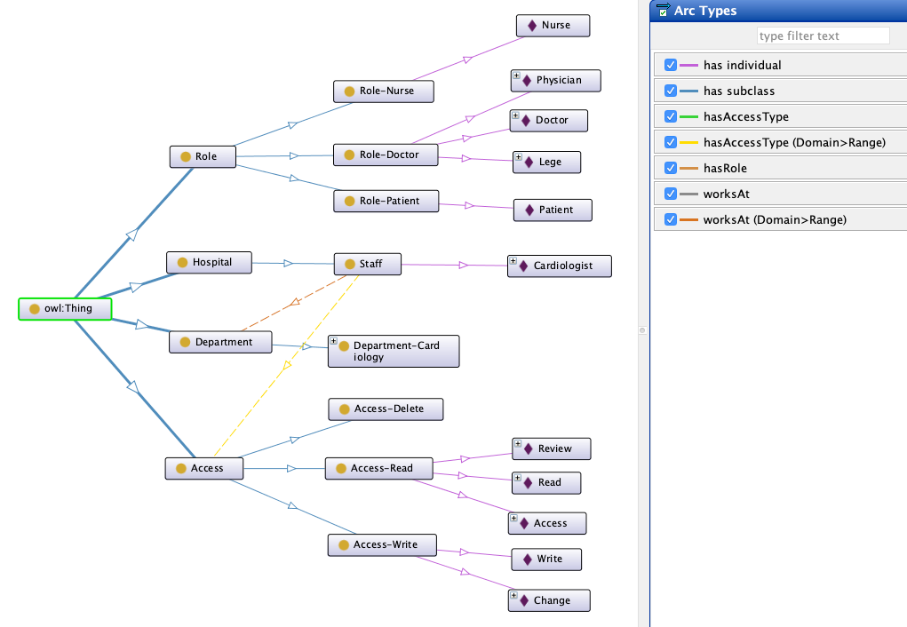

## Semantic Attributed Based Access Control (SABAC)

#### Master Thesis Project - Semantic Attribute Based Access Control

####Ontology: 
Hospital staff ontology contains concepts representing hospital domain information and relationships between concepts.

####Main classes:  
- Access
    - Access-Delete
    - Access-Read
    - Access-Write
- Department
    - Department-Cardiology
- Hospital
    - Staff
-Role
    - Role-Doctor
    - Role-Nurse
    - Role-Patient
    

####Exposed endpoints: 

* /semantic-reasoner/query-by-role/{roleName}
* /semantic-reasoner/query-by-access-type/{accessType}
* /semantic-reasoner/query-by-access-type/{accessTypeName}/for/{roleName}

Semantic reasoner app parses implemented ontology to extract synonyms for given criterias by: roleName, accessTypeName. 
